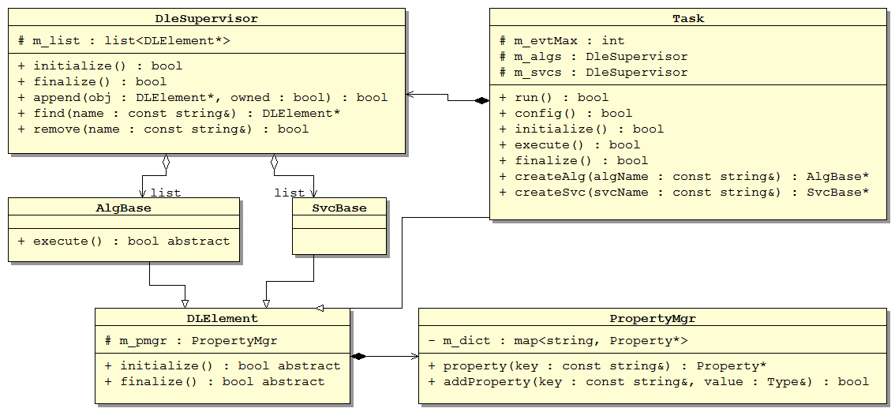

# Architecture

In this chapter, we will give some general introductions to the SNiPER architecture. We hope you will have a brief impression to the main conpoments and principles of the framework.


## General Concepts

In SNiPER, users can implement their own modules, which can be loaded and executed dynamically at run time. We call these modules as Dynamically Loadable Elements (DLE). According to the roles they played in SNiPER, DLE modules are further distinguished as algorithms, services and tasks.

> It’s helpful if you are familiar with [Gaudi](http://gaudi.web.cern.ch/gaudi/). There are some similarity. The concepts of algorithm and service in SNiPER are equivalent to that in Gaudi, and task is somewhat like the application manager. However, we will assume our readers as fresh users of any software frameworks. 

Let's consider a general data processing procedure. There are a seqence of events in the data, and we process the events one by one with a loop (the so-called events loop).

```flow
st=>start: Start
e=>end: End
in=>inputoutput: Read an Event
op1=>operation: Process an Event
out=>inputoutput: Save Result
cond=>condition: More Event ?

st->cond
cond(yes,right)->in->op1(right)->out
cond(no)->e
out(right)->cond
```
There can be a fixed procedure to each event: read in the event data, perform some calculation, and then write out the result. During the calculation, we may occasionally access the detector geometry, database, or anything else. In this application, each subroutine can be implemented as a module, so that they can be assembled and reused easily for different purpose. These subroutines, in SNiPER, are mainly the algorithms and services.

The following show the difference between algorithm and service, and the role of task.

- algorithm: the calculation subroutine that applied to each event, for example, a reconstruction algorithm. Generally it is invoked by the framework during the event loop.
- service: the subroutine to provide a specific functionality, for example, users can access the detector geometry via the specified geometry service. It can be invoked by users' code or the framework whenever we want.
- task: the manager of algorithms and services, and the controller of the event loop. The entrance of a SNiPER application is always a task.

In SNiPER, there are some more assistant functionalities that can be invoked globally, including PropertyMgr, SniperLog and IncidentMgr.

- property: a configurable variable. Users can customize its value during the job configuration, without code modification and re-compiling.
- SniperLog: logs with output levels. Users can selectively print more or less messages, for debugging or production purpose.
- incident: a trigger to the registered subroutines (incident handlers). This is also a concept that taken from Gaudi.

The following picture shows these components togother.


## User Interfaces

In a framework, there are always some conventions to implement a module. Only the legal modules can be recognized by the framework, and be used like plugins.

In SNiPER, the most frequently used concepts are algorithm and service. They are expressed as C++ classes.

- a concrete algorithm class must be inherited from the AlgBase class;
- a concrete service class must be inherithed from the SvcBase class;

Moreover, we have to at least implement the following 3 methods in a concrete algorithm, which are defined as abstract interface in the base classes.

- initialize(): be invoked once by the framework before the event loop. We can add any preparation works here.
- execute(): be invoked once to each event by the framework during the event loop. We can perform the data calculations here.
- finalize(): be invoked once by the framework after the event loop.

It is similar to a concrete service class, except that the SvcBase class doesn't have an abstract execute() method.

The following picture shows the core C++ class diagram in SniperKernel.



Suppose we have implemented an algorithm, then how to use it in our job? This is configured by the Python interface of SNiPER.

Let's take an example, there is a HelloAlg algorithm class in the SNiPER (package Examples/HelloWorld). Then a minimal Python configuration may look like the following code.

```python
#!/usr/bin/env python

import Sniper
task = Sniper.Task("task")  # create a Task instance
task.setEvtMax(3)  # set the number of the event loop
   
import HelloWorld  # load the HelloWorld module into SNiPER
task.property("algs").append("HelloAlg")  # create a HelloAlg instance

#start the processing procedure
#the HelloAlg::execute() will be invoked 3 times during the event loop
task.run()
```
We can save the code in a python script file and execute it directly.

```
$ python run.py
```

We only show the form to configure and execute a SNiPER application here. The details will be described in later setions.


## Execution Sequence

The execution of SNiPER mainly consists of 3 steps, initialize, events loop and finalize. Each step consists some sub-steps as following,

1. initialize
  1. all services are initialized in the order of their creation;
  2. then all algorithms are initialized in the order of their creation;
2. events loop: loop all events. To each event, the following procedures are applied,
  1. broadcast an incident named BeginEvt (begin event);
  2. invoke the execute() method of all algorithms, in the order of their creation;
  3. broadcast an incident named EndEvt (end event);
3. finalize
  1. all algorithms are finalized in the inverted order of their creation;
  2. then all services are finalized in the inverted order of their creation;

The following shows the execution sequence diagram.

```sequence
    participant Task
    participant SvcSupervisor
    participant AlgSupervisor
    participant IncidentMgr
    Note over Task:config
    Task->>SvcSupervisor:initialize
    Note over SvcSupervisor:initialize\nservices list
    Task->>AlgSupervisor:initialize
    Note over AlgSupervisor:initialize\nalgorithms list
    Task->>AlgSupervisor:start events loop
    AlgSupervisor->>IncidentMgr:BeginEvt
    Note right of AlgSupervisor:execute all\nalgorithms
    AlgSupervisor->>SvcSupervisor:optional invokes
    SvcSupervisor-->>AlgSupervisor:result
    AlgSupervisor->>IncidentMgr:EndEvt
    AlgSupervisor--AlgSupervisor:loop to BeginEvt
    AlgSupervisor-->>Task:end events loop
    Task->>AlgSupervisor:finalize
    Note over AlgSupervisor:finalize\nalgorithms list
    Task->>SvcSupervisor:finalize
    Note over SvcSupervisor:finalize\nservices list
    Note over Task:terminate
```
