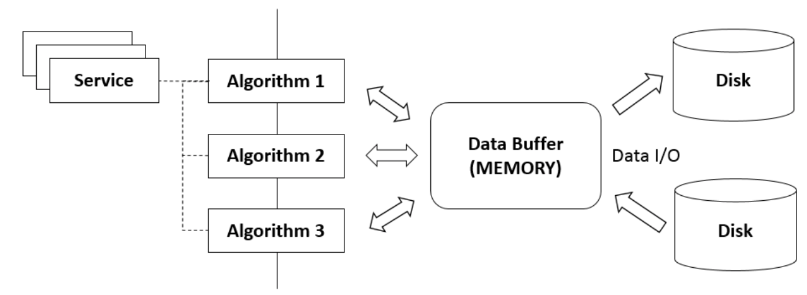
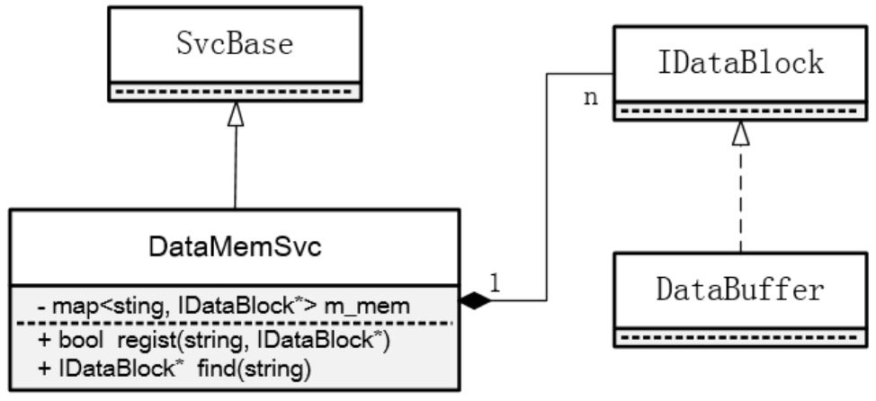
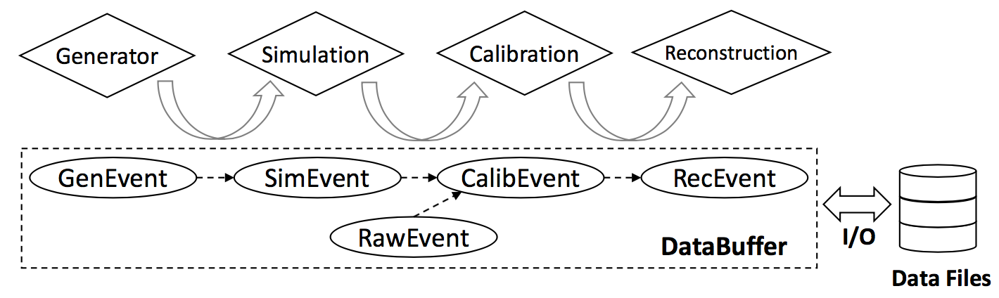

# Data Management

Data management \(DM\) system is designed to manage the event data during offline data processing. It includes the event data model \(EDM\) which defines the event data entity to be processed, the memory manager that holds the EDM objects in memory and the data input/output \(I/O\) system that implements the writing and reading of data files.

SNiPER provides the basic idea and architecture of DM system, on which developers could develop the experiment-specific system based on their requirements. This chapter introduces the basic SNiPER DM architecture as well as the DM system of JUNO \(Jiangmen Underground Neutrino Observation\) offline software as an example.

## General Concept

In previous chapters, we have introduced the primary components of SNiPER, including Task, Algorithm and Service, and how the event processing procedure \(event loop\) is achieved based on them. Now the vital issue is that how the DM functionalities are achieved in the event loop. This includes the layout of the event data in memory, the interfaces for users to access data, as well as the I/O of the event data. Based on our experience, it's beneficial to encapsulate the DM functionalities in a set of modules with standard interfaces, so that the user-level code does not have to care about the details of DM.

### Overall Design

The figure below shows how the DM modules interact with the event loop process in an typical application developed  on top of SNiPER. In a SNiPER task, multiple Service and Algorithm instances can be defined, and they would share the DM modules including the data store \(i. e. DataBuffer\) and Data I/O services. During event processing, Service and Algorithm instances access event data in form of EDM objects via the common interfaces of the data store. Meanwhile, the data store is associated with the Data I/O services which perform the data I/O before/after each event is processed \(conversion of transient EDM objects and data files\).

### Data Store Management

In order to simplify the kernel and decouple from the experiment-specific functionalities, SNiPER does not provide concrete DM implementation, except the DataMemSvc as the mechanism of memory management based on which developers can custom their own data store modules.

The following figure shows the design of DataMemSvc. DataMemSvc is a SNiPER service that is internally created by SNiPER kernel for each task. By calling the regist\(\) interface, an IDataBlock instance can be registered into the DataMemSvc, identified by a string parameter. IDataBlock is an abstract class that must be implemented to provide the data store functionalities. We have provided a concrete implementation of IDataBlock, the DataBuffer, as a double-ended queue to hold multiple events, which will be introduced in the following sub-chapter. After an IDataBlock instance has been registered, users can retrieve it with its string identifier, and then access data managed by them via a tool named SniperDataPtr. SniperDataPtr will be introduced in the following sub-chapter as well.

## Relevant Utilities

### Data Buffer

DataBuffer is a dynamically allocated region of memory that holds multiple events in order to facilitate correlation analysis. The size is configured with a time window. In each execution, an event acts as the anchor of the time window and its adjacent events in the time window are cached in the DataBuffer simultaneously. During the event loops, the anchor event moves forward one by one, and events in the time window are accordingly updated.

### RootWriter

TODO...

## Example: JUNO Data Management

The JUNO offline software is designed to fulfill many requirements including Monte Carlo \(MC\) data produc- tion, raw data calibration, and event reconstruction as well as to provide tools for the physics analysis.The JUNO offline software is based on the general SNiPER framework with the main components implemented as SNiPER plugins.

The DM modules are the core parts of the JUNO offline software, including the event data model \(EDM\), memory management modules and ROOT I/O systems. The figure below illustrates the JUNO offline software workflow, where the DM module play a vital part.

Take the simulated data production as an example, the Generator stage applies physics generators to produce GenEvent objects. These GenEvent objects are used as the input to the Simulation stage which models the detector and electronics response. Similarly the Calibration and Reconstruction stages read data from the previous step and produce CalibEvent and RecEvent objects, respectively. All event data objects, such as GenEvent, SimEvent, RawEvent, CalibEvent and RecEvent, are defined and implemented by the JUNO EDM. During data processing, The EDM objects are held in a dynamically allocated region of memory named DataBuffer managed by the memory manager module. The event data at all stages can be persisted to files in the form of ROOT TTrees or read back into memory by the ROOT I/O system.

This sub-chapter introduces the design of JUNO DM modules based on the SNiPER scheme, aimed at inspiring the software developers of other experiments.

### Event Data Model

TODO...

### Memory Management

TODO...

### ROOT I/O

TODO...
