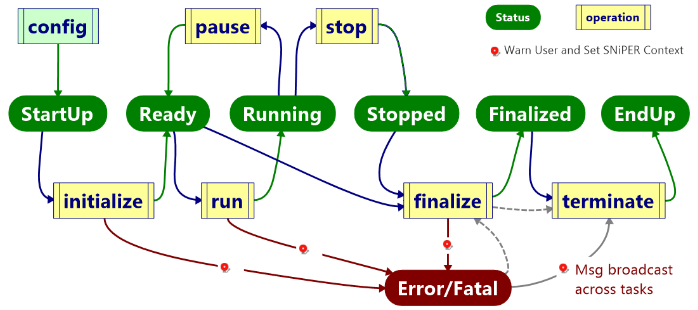

# Task

Tasks act as lightweight application managers, containing algorithms, DataBuffer, services and other subtasks. Tasks are dynamically configurable and orchestrate the sequential execution of the contained algorithms. Different tasks are executed with an incident mechanism, enabling event mixing and splitting to be implemented.

## State Machine

